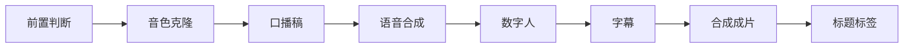

# AutoVid 短视频口播工作台

AutoVid 是一个基于 LangGraph 的短视频口播生成工作流。它把已有文案或选题、个人音色、人物形象和本次场景照片组织成可恢复的生成流程，最终输出带字幕的竖屏口播视频。

项目当前只负责生成视频、封面和标题标签，不包含社交平台自动发布。

## 主要能力

- **八节点工作流**：前置检查、音色克隆、口播稿、语音合成、数字人、字幕、成片、标题标签。
- **可插拔 Provider**：语音和数字人通过统一接口接入，供应商、模型与密钥在设置页管理。
- **严格失败模式**：所选 API 失败时直接停止并说明认证、余额、权限或响应问题，不会偷偷换成默认声音、静态画面或本地模型。
- **音色与形象资产库**：管理参考音频、朗读文本、人物照片和主图；云端音色 ID 会按 Provider 缓存。
- **精确字幕时间轴**：按气口句逐句合成语音，再根据 PCM 样本数生成 ASS 字幕时间轴。
- **断点恢复**：LangGraph 检查点保存运行状态，异常中断后可从失败节点继续，已完成节点不会重复执行。
- **中间产物可用**：任务失败后仍可下载已经生成的音频、数字人片段和字幕等文件。
- **本地 Web 工作台**：提供创作、音色库、形象库、供应商设置、实时进度和历史运行界面。

## 工作流



| 节点 | 作用 | 主要产物 |
| --- | --- | --- |
| 前置判断 | 检查文案、音色、形象、场景照片、Provider 和输出目录 | 检查结果与明确错误 |
| 音色克隆 | 注册或复用所选音色的云端音色 ID | 音色注册信息 |
| 口播稿 | 使用自有文案，或根据选题生成结构化口播稿 | 分段文案 |
| 语音合成 | 按气口句合成并拼接配音 | WAV 与逐句时间轴 |
| 数字人 | 使用场景照片和配音驱动口型、表情与动作 | 一个或多个视频片段 |
| 字幕 | 根据语音时间轴生成 ASS 字幕 | `subtitles.ass` |
| 合成成片 | 统一视频规格、拼接片段、加入音频并烧录字幕 | `final.mp4`、封面图 |
| 标题标签 | 根据文案整理标题、简介和标签建议 | 元数据 JSON |

文案确认和试听音色是可选的人审闸门，默认关闭；在 Web 工作台勾选后才会暂停等待确认。

## 快速开始

### 1. 获取代码

```powershell
git clone https://github.com/2528078765/AgentProject.git
cd AgentProject\shortvideo-agent
```

### 2. 准备环境

建议使用 Windows 10/11、Python 3.11 或更高版本，并确保 `ffmpeg`、`ffprobe` 可以在终端直接运行。

LangGraph 依赖安装在项目自己的 `.pylibs/` 中，不污染系统 Python：

```powershell
python scripts\vendor_deps.py langgraph
python scripts\vendor_deps.py langgraph-checkpoint-sqlite
python scripts\check_env.py
```

### 3. 启动工作台

```powershell
python -m autovid web --open
```

默认地址为 `http://127.0.0.1:8899/`。如果端口被占用，程序会自动选择其他可用端口并在终端显示。

### 4. 完成首次配置

1. 打开“设置”，分别添加语音和数字人 Provider。
2. 选择供应商与已适配模型，填写 API Key 和供应商要求的附加字段。
3. 点击“测试连通”。测试只检查连接、鉴权和模型权限，不提交生成任务。
4. 在“音色库”创建音色并上传参考音频和对应朗读文本。
5. 在“形象库”创建人物形象，上传清晰照片并选择主图。
6. 回到“创作”，上传本次场景照片，填写选题或自有文案后开始生成。

未配置的 Provider 不会出现在创作页的引擎选择中。音色和形象属于必需资产，没有可用资产时，创作页会直接引导到对应资产库。

## Provider 机制

设置页中的“供应商”与“模型”是两层选择：供应商只显示平台名称，模型下拉框只列出当前工作流已经适配的模型。供应商拥有其他模型并不代表这些模型已经符合本项目的请求和结果协议。

官方固定接口会自动填写并锁定；自建服务和兼容接口可以手动填写地址与模型 ID。新增适配主要集中在：

- `autovid/providers_registry.py`：供应商模板、模型、字段和能力声明。
- `autovid/providers.py`：语音、音色克隆和数字人调用实现。
- `autovid/provider_caps.py`：分辨率、素材限制和失败签名。

Provider 配置保存在 `config/providers.json`，API Key 单独保存在被 Git 忽略的 `config/secrets.json`。

## 素材要求

### 音色

- 只上传本人声音或已经获得明确授权的录音。
- 建议使用安静环境下连续、自然的朗读音频，并填写与录音一致的参考文本。
- 更换参考音频后，原云端音色缓存会失效并重新注册。

### 形象与场景照片

- 只使用本人照片或已获得授权的人物素材。
- 形象库照片用于身份参考；创作页上传的场景照片决定本次视频画面和背景。
- 自然讲解模式建议单人、正脸清晰、腰部以上、双手完整入镜，避免遮挡和复杂背景。
- 最终清晰度受数字人 Provider 的原始输出限制；导出为 1080×1920 不会把低分辨率素材变成真实 1080p。

`assets/`、`scenes/`、`runs/` 和 `.tmp/` 均已加入 `.gitignore`，不要把声音、照片和生成视频提交到仓库。

## 运行、恢复与产物

每次运行保存在 `runs/<运行编号>/`。Web 工作台会显示每个节点的状态与实时日志，并在历史记录中提供：

- 查看已完成结果；
- 下载异常前生成的片段；
- 修正配置后从失败节点继续。

LangGraph 使用 SQLite Checkpoint 保存状态，因此关闭工作台或重启进程后仍可恢复。命令行也可以检查和恢复人工闸门：

```powershell
python -m autovid graph state --thread <thread-id>
python -m autovid graph resume --thread <thread-id> --decision approve
```

直接使用命令行生成时，需要提供音色、形象和场景照片：

```powershell
python -m autovid graph run `
  --script-file "examples\自然口播样片.txt" `
  --voice-id <voice-id> `
  --avatar-id <avatar-id> `
  --scene-photo "path\to\scene.jpg"
```

## 项目结构

```text
autovid/
  graph.py                 LangGraph 八节点编排、闸门和恢复
  providers.py             Provider 调用与统一结果
  providers_registry.py    供应商模板和设置页元数据
  provider_caps.py         能力限制与错误分类
  assets.py                音色库和形象库
  media.py                 FFmpeg、ASS 字幕和媒体检查
  web/
    server.py              本地 HTTP、SSE、历史记录和下载接口
    static/index.html      无前端框架的工作台页面
config/
  pipeline.json            输出规格和工作流参数
  providers.json           已添加的 Provider
scripts/                   环境检查、部署、探测与冒烟测试
examples/                  示例口播稿
```

## 开发与验证

常用的无付费验证命令：

```powershell
python -m compileall -q autovid
python scripts\smoke_flow_web.py
python scripts\smoke_provider_caps.py
```

`scripts/smoke_*.py` 是本项目的回归测试入口。常规测试优先使用本地模拟服务，不要默认调用会产生费用的云端生成接口。修改 Provider 时，至少覆盖成功、认证失败、余额或额度不足、权限不足和异常响应。

贡献规范见 [AGENTS.md](AGENTS.md)。

## 安全与隐私

- 不要提交 `config/secrets.json`，也不要在日志、Issue 或截图中暴露 API Key。
- 语音克隆和数字人生成必须获得声音与肖像权授权。
- 云端 Provider 可能上传参考音频、人物照片和文案，请在使用前阅读对应服务条款。
- 接口失败必须明确报错；不要用默认声音、静音、静态画面或其他模型掩盖失败。

## License

本项目采用 [MIT License](LICENSE)。
